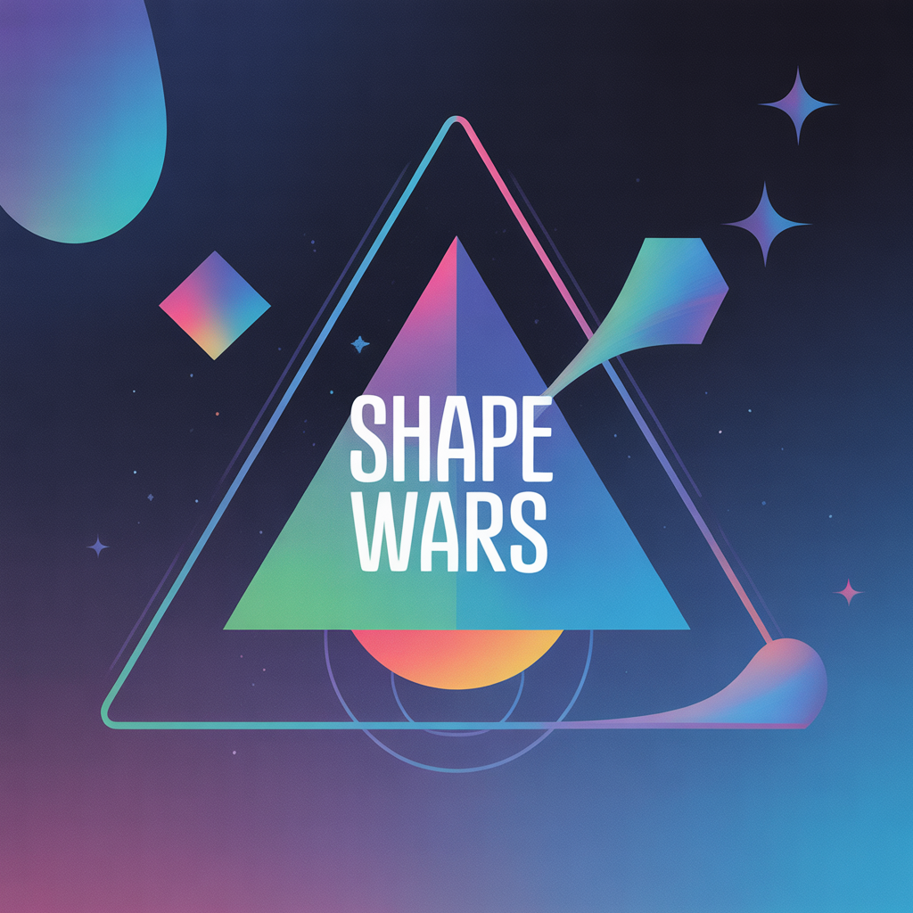

# Shape Wars

 <!-- Placeholder for a banner image -->

A fast-paced, geometric-themed arcade shooter built with React & TypeScript. Pilot your triangle ship against waves of enemy shapes where complexity equals strength. Dodge, shoot, and survive the geometric onslaught!

## Features

- **Dynamic Arcade Action:** Experience classic top-down shooter gameplay with modern, smooth controls.
- **Two Unique Game Modes:**
  - **Campaign:** Battle through 10 handcrafted levels of increasing difficulty, culminating in an epic boss fight against the ultimate shape—the Circle.
  - **Endless:** Face off against relentless, ever-strengthening waves of enemies to chase the ultimate high score.
- **Strategic Upgrade System:** Earn currency by destroying enemies and spend it between rounds to upgrade your ship's fire rate, missile systems, and armor.
- **Unique "Shape Hierarchy" Theme:** The game's art style is built on a simple premise: more edges mean more power. From your nimble triangle ship to the formidable hexagon brutes, every entity has a distinct geometric form.
- **Responsive Controls:** Intuitive mouse-based movement and clicking for combat.

## Gameplay & Controls

Your objective is to clear each level of enemy shapes while avoiding their projectiles and direct collision.

- **Move:** Move your mouse across the game area to control your ship.
- **Fire Standard Projectile:** Hold **Left Mouse Button**.
- **Fire Missile:** **Right Click** to launch a powerful, area-of-effect missile on a cooldown.

## Tech Stack

- **Frontend:** React, TypeScript
- **Styling:** Tailwind CSS
- **Fonts:** Google Fonts (Orbitron)

## How to Run

This project is set up as a simple static website. To run it, open the `index.html` file in a modern web browser that supports ES modules. No build step is required.
